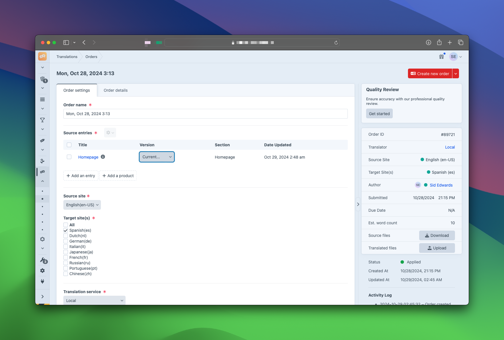

# Translations for Craft CMS

The Translations plugin provides a simple way to translate your content from start to finish without leaving Craft CMS. With support for Export/Import and and professional Acclaro translation services, the plugin makes it easy to submit, track, review, and publish content using your own translators or Acclaro’s.

## ✨ Features
- Eliminate error-prone and time-consuming copy/paste workflows.
- Work with [Acclaro’s professional linguists](https://www.acclaro.com/services/?utm_campaign=Craft%20Plugin%20Store&utm_source=Craft%20Plugin%20Store%20Listing%20-%20Human%20Translation%20Services&utm_medium=Listing) or use your own translation provider.
- Intuitive review, approval, and publishing workflows.
- Easily submit source content from your Entries, Categories, Globals, and Assets.
- Manage your [Static Message Translations](https://craftcms.com/docs/3.x/sites.html#static-message-translations) with ease.
- Supports many 3rd party plugins including SEOmatic, Neo, Super Table, and more!

  *Need support for a specific plugin? [Contact us](http://www.acclaro.com/translation-services-cost/?utm_campaign=Craft%20Plugin%20Store&utm_source=Craft%20Plugin%20Store%20Listing%20-%20Third%20Party%20Plugins%20Quote&utm_medium=Listing) for a quote.*

## ⚠️ System Requirements
- Craft CMS 4.0.0 or later.
- PHP 8.0.2+
- PHP [DOM](https://docs.craftcms.com/v3/requirements.html#optional-php-extensions) Extension
- Craft [Multi-site](https://craftcms.com/docs/3.x/sites.html) configuration

## 🔌 Installation

> **🔔 Reminder:** Before installing the plugin, it’s recommended you back up your site. We also recommend testing multisite settings and configuration changes on a staging site prior to implementing in a production environment.

To install the plugin, follow these instructions.

1. Open your terminal and go to your Craft project:

        cd /path/to/project

2. Then tell Composer to load the plugin:

        composer require acclaro/translations

3. In the Control Panel, go to Settings → Plugins and click the “Install” button for Translations.

You can also [install Translations via the Plugin Store](https://plugins.craftcms.com/translations) or from the Craft Control Panel.

## 🚀 Gettings Started

Please refer to the [Getting Started Guide](https://github.com/AcclaroInc/craft-translations/wiki/Getting-Started) for detailed plugin setup. For recommended workflows, FAQs, and additional documentation, visit our plugin [Wiki](https://github.com/AcclaroInc/craft-translations/wiki).

## ℹ️ Additional Information
### Pricing
The license fee for this plugin is $999.00 via the Craft Plugin Store. Annual license renewals can be purchased for $399.00. (Pricing is subject to change without prior notice)

We offer a 30-day money back guarantee for the software plugin purchase if you are not satisfied.

### Terms
Prior to download, installation and use of the Translation Plugin for Craft on a public site, site owners are required to purchase the plugin from the Craft plugin store or submit payment directly to Acclaro for purchases outside of the store.

Any usage of the plugin either on production or in a sandbox environment indicates your acceptance of the legal terms described in the [Craft Software License](https://craftcms.github.io/license/). Any usage of Acclaro Translation Service API integrations indicates acceptance of the terms and conditions as set forth in the [Acclaro User Agreement](https://my.acclaro.com/p.php/useragreement) and [Privacy Policy](https://www.acclaro.com/privacy-policy/).

### Updates & support
Purchasing the plugin includes 12 months of updates and API connectivity access. Additional license renewals are $399/yr. Advanced standalone product and multisite consulting support for the Translation plugin can be purchased separately from Acclaro.

### Contributing
Want to extend the Translations plugin with your own developed code? If it’s functionality that other plugin users can also take advantage of, let us know and we’ll guide you on how to submit a Git PR.  We’ll review, test and integrate as fast as we can.
